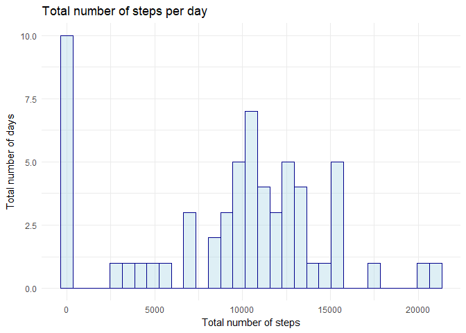
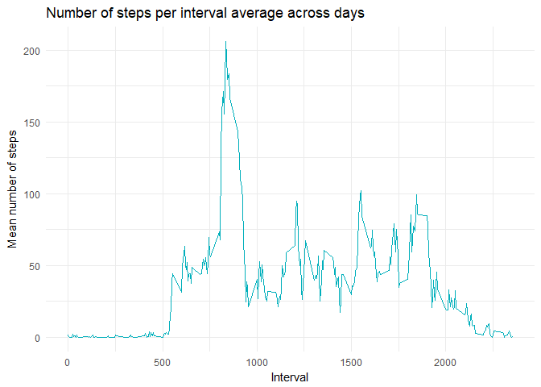
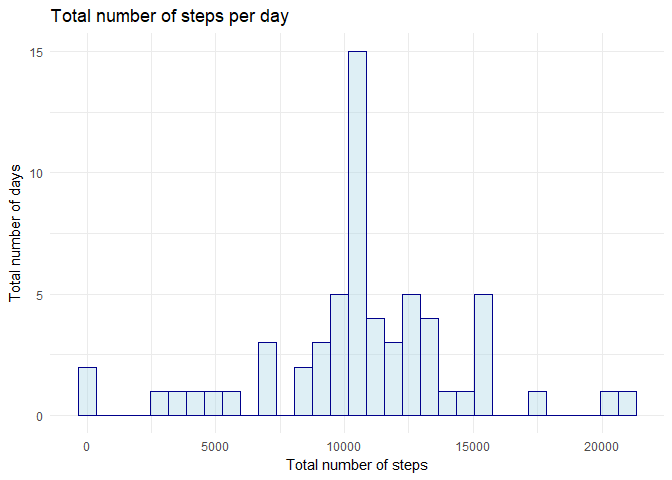
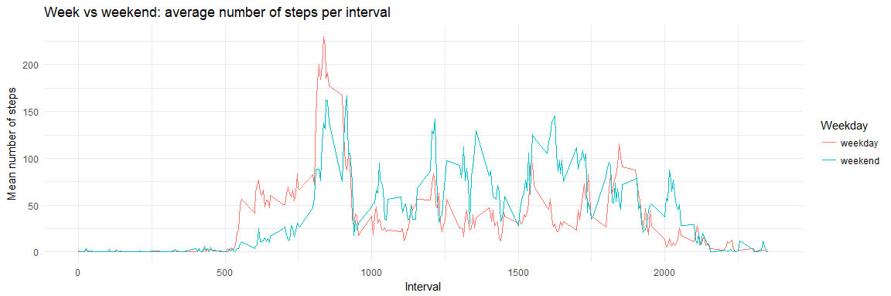

# PA1_template
Meijke  
2018 M08 20  

# Activity Monitoring Patterns
## Reproducible research - Peer graded Assignement week 2

This assignment makes use of data from a personal activity monitoring device. This device collects data at 5 minute intervals through out the day. The data consists of two months of data from an anonymous individual collected during the months of October and November, 2012 and include the number of steps taken in 5 minute intervals each day. A few questions on the data will be answered in the next paragraphs. Each paragraph will contain the written code and relevant analysis to answer the question.

### Load and preprocess the data

In preprocessing the data, I change the class of most variables. Dates were transformed to the correct POSIXct date and steps are now considered a numeric variable.


```r
# Load the data from csv file
activity <- read.csv("C:/Users/mgorter/Desktop/Rfiles/activity.csv", header = TRUE, sep = ",")

# Check the structure
str(activity)

# Change dates to correct POSXIT class
activity$date <- as.POSIXct(activity$date, format = "%Y-%m-%d")

# Class steps to numeric
activity$steps <- as.numeric(activity$steps)
```

### Steps per day

The histogram shows the total number of steps taken each day. On the graph you can see that there were 10 days that a total of 0 steps were taken. The mean and median number of steps can be found in the following table. The mean number of steps per day is **`R mean(meanday$Steps)`** and the median number of steps per day is **`R median(meanday$Steps)`**  Missing values are not considered in this plot. 


```r
# Aggregate the data per day by taking the mean
meanday <- aggregate(activity$steps, by = list(activity$date), FUN = sum, na.rm = TRUE)

# Change column names
colnames(meanday) <- c("Day", "Steps")

# Make a histogram of steps per day
ggplot(meanday, aes(x = Steps)) +
     geom_histogram(binwidth = 700, col = "darkblue", fill = "lightblue", alpha = 0.4) +
     labs(x = "Total number of steps", y = "Total number of days", title = "Total number of steps per day") +
     theme_minimal()
```

<!-- -->

```r
# Calculate the mean and median steps per day by descriptives
kable(describe(meanday$Steps))
```

      vars    n      mean         sd   median    trimmed        mad   min     max   range         skew     kurtosis         se
---  -----  ---  --------  ---------  -------  ---------  ---------  ----  ------  ------  -----------  -----------  ---------
X1       1   61   9354.23   5405.895    10395   9503.286   4532.308     0   21194   21194   -0.3764926   -0.5237221   692.1539

### Daily Activity Pattern

This time series plot shows the average number of steps taken in each interval across all days in the data set. It shows the highest peak at interval **835**, where an average of 206.2 steps are taken. 


```r
# Average number of steps by day and interval
dailypattern <- aggregate(activity$steps, by = list(activity$interval), FUN = mean, na.rm = TRUE)

# Change column names
colnames(dailypattern) <- c("Interval", "Steps")

# Make a time series plot of interval and average number of steps across all days
ggplot(dailypattern, aes(x = Interval, y = Steps)) +
     geom_line(typ = "l", color = "#00AFBB", size = 0.5) +
     labs(title = "Number of steps per interval average across days", y = "Mean number of steps") +
     theme_minimal()
```

<!-- -->

```r
# Show interval that contains maximum number of steps
kable(dailypattern[which.max(dailypattern$Steps), ])
```

       Interval      Steps
----  ---------  ---------
104         835   206.1698

### Missing values

There are **** number of rows that contain missing values in this data set. The presence of missing values may introduce bias in some of the above calculations. The missing values are clusterd by day and only present in the column Steps. Each time, 288 missing values are on the same day, meaning that probably that person did nog wear the wearable that day. Replacing the missing value with the mean value of that day thus doesn't make sense. Instead, we calculate the average number of steps of each interval and replace the missing value with average of the corresponding interval. 

The mean number of steps taken on a day is now **10766** and the median has changed to **10766**. The mean has increased, since there are now less values that are considered 0. Also, the median and mean are now equal to each other and the data looks more normally divided. 


```r
# Calculate total number of missing values in data set
missing <- activity[!complete.cases(activity), ]

# Number of days that contain missing values
summary(as.factor(missing$date))
```

```
## 2012-10-01 2012-10-08 2012-11-01 2012-11-04 2012-11-09 2012-11-10 
##        288        288        288        288        288        288 
## 2012-11-14 2012-11-30 
##        288        288
```

```r
# Create copy of activity data set
activity_complete <- activity

# Insert missing value with the average of that interval 
activity_complete$steps <- ave(activity$steps, activity$interval, FUN = na.aggregate)

# Aggregate the data per day by taking the mean
complete_mean <- aggregate(activity_complete$steps, by = list(activity_complete$date), FUN = sum, na.rm = TRUE)

# Change column names
colnames(complete_mean) <- c("Day", "Steps")

# Make same histogram as before
ggplot(complete_mean, aes(x = Steps)) +
     geom_histogram(binwidth = 700, col = "darkblue", fill = "lightblue", alpha = 0.4) +
     labs(x = "Total number of steps", y = "Total number of days", title = "Total number of steps per day") +
     theme_minimal()
```

<!-- -->

```r
# Calculate the mean and median steps per day by descriptives
kable(describe(complete_mean$Steps))
```

      vars    n       mean         sd     median   trimmed        mad   min     max   range         skew   kurtosis         se
---  -----  ---  ---------  ---------  ---------  --------  ---------  ----  ------  ------  -----------  ---------  ---------
X1       1   61   10766.19   3974.391   10766.19   10947.4   2854.285    41   21194   21153   -0.3248032   1.154314   508.8686

### Activity patterns for weekdays and weekends

The following plot shows the differences in daily activity between weekdays and weekend. You see on average that people move more on weekends. However, people also seem to sleep in and have lazy mornings in the weekends, since activity in weekdays is higher in the beginning of the day.


```r
# Create new variable that indicates weekday
activity_complete$weekday <- weekdays(activity_complete$date)

# Change mon-friday to week
activity_complete$weekday[activity_complete$weekday %in% c("Monday", "Tuesday", "Wednesday", "Thursday", "Friday")] <- "weekday"

# Change saturday-sunday to weekend
activity_complete$weekday[activity_complete$weekday %in% c("Saturday", "Sunday")] <- "weekend"

# Make weekday variable factor with 2 levels
activity_complete$weekday <- as.factor(activity_complete$weekday)

# Average number of steps by day and interval
dailypattern_complete <- aggregate(activity_complete$steps, by = list(activity_complete$interval, activity_complete$weekday), FUN = mean, na.rm = TRUE)

# Change column names
colnames(dailypattern_complete) <- c("Interval", "Weekday", "Steps")

# Make a time series plot of interval and average number of steps across all days
ggplot(dailypattern_complete, aes(x = Interval, y = Steps, color = Weekday)) +
     geom_line(typ = "l", size = 0.5) +
     labs(title = "Week vs weekend: average number of steps per interval", y = "Mean number of steps") +
     theme_minimal()
```

<!-- -->

